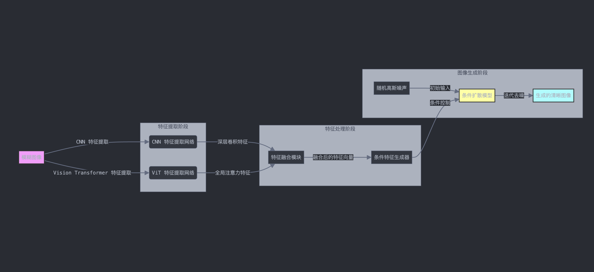

# 基于 CNN、ViT 和扩散模型融合的运动模糊图像修复

## 模型介绍

本项目提出了一种融合 **卷积神经网络（CNN）**、**视觉 Transformer（ViT）** 和 **扩散模型** 的创新性运动模糊图像修复方法。通过将 CNN 和 ViT 提取的特征进行融合，作为条件引导扩散模型的去噪生成过程，实现对模糊图像的高质量修复。

## 模型架构

- **特征提取模块**：
  - **CNN**：使用预训练的 ResNet18 提取局部细节特征，擅长捕捉图像的细节信息。
  - **ViT**：使用预训练的 ViT 提取全局依赖特征，擅长捕捉图像的长距离依赖和全局信息。
  - **特征融合**：将 CNN 和 ViT 提取的特征进行拼接，形成融合特征向量，结合局部和全局信息。

- **条件扩散模型**：
  - **条件输入**：融合特征向量作为条件输入，指导扩散模型的去噪过程。
  - **扩散过程**：
    - **正向扩散**：对清晰图像添加噪声，模拟从数据到噪声的过程。
    - **反向扩散**：模型学习从噪声到数据的逆过程，逐步去噪生成清晰图像。

- **UNet 结构**：采用多尺度特征处理，通过编码器-解码器架构，确保条件信息在整个去噪过程中被有效利用。

## 创新点

- **多模态特征融合**：首次在扩散模型中融合 CNN 和 ViT 的特征，充分利用局部和全局信息。
- **条件引导生成**：利用融合特征作为条件，引导扩散过程，提高去模糊效果。
- **高效模型设计**：设计了适合该任务的模型结构和训练策略，兼顾性能和效率。



## 环境配置

使用以下命令安装所需的Python库：

```bash
pip install -r requirements.txt
```

## 数据准备

在项目目录下创建数据文件夹，并准备训练、验证和测试数据集：

```
data/
├── blur_train/     # 训练用的模糊图像
├── sharp_train/    # 训练用的清晰图像
├── blur_val/       # 验证用的模糊图像
├── sharp_val/      # 验证用的清晰图像
├── blur_test/      # 测试用的模糊图像
```

确保模糊和清晰图像的文件名一一对应。

### 获取数据集

可以使用 **GoPro Dataset** 或 **REDS Dataset**，也可以自行合成数据：

- **自合成数据**：对清晰图像应用随机的运动模糊核生成对应的模糊图像。

## 训练模型

```bash
python main.py
```

训练过程中，模型的权重会在每个 epoch 结束时自动保存为 `model_epoch_{epoch_number}.pth` 文件。

## 测试模型

训练完成后，`main.py` 会自动对测试集进行推理，结果保存在 `results/` 文件夹中。

## 注意事项

- **GPU需求**：由于模型复杂度较高，建议在支持 CUDA 的 GPU 上运行。
- **参数调整**：可以根据硬件条件和数据集规模，调整 `main.py` 中的超参数，如 `num_epochs`、`batch_size` 等。
- **预训练模型下载**：运行代码时，`torchvision` 和 `transformers` 会自动下载预训练模型，需要确保网络连接。
- **扩展方向**：可以尝试调整特征提取模块、改进扩散过程、引入额外的损失函数等进一步提升性能。
